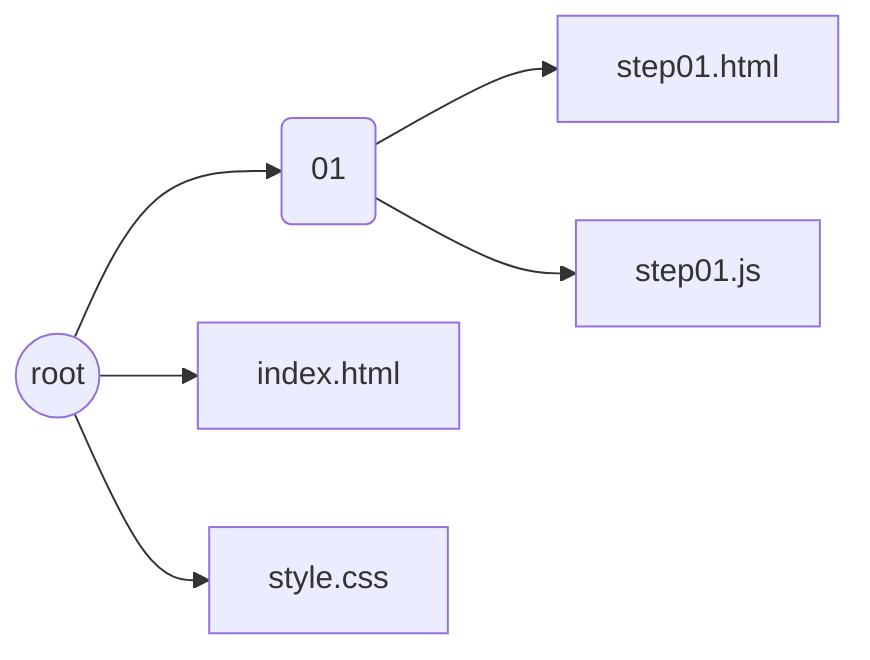

# Binding `*.css` file to a `.html` file

This is a practice project, The goal is: 

> binding a `.css` file contains some `css-variable`s to a `.html` file
> using Javascript.

*<small>_for more information on `` read these two articles: [MDN](https://developer.mozilla.org/en-US/docs/Web/CSS/Using_CSS_custom_properties) | [CSS-Tricks](https://css-tricks.com/a-complete-guide-to-custom-properties/)</small>*

## File 01

Here I'm just working with `style.css` containing some `css-variables`. the result is produced in `step01.html` file.

 - The `step01.js` doesn't do anything but logging a description about  
   what's going on. 
   
- The `index.html` provided just for navigating
   between steps.

## File 02

Here I'm actully creating a `link` element in `step02.js` file, attaching the `style.css` to it and adding it into the `step02.html` file.

## File 03

webpack

## File 04

directly