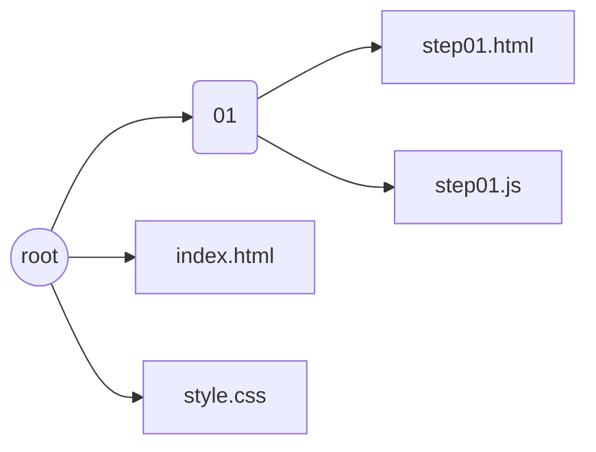
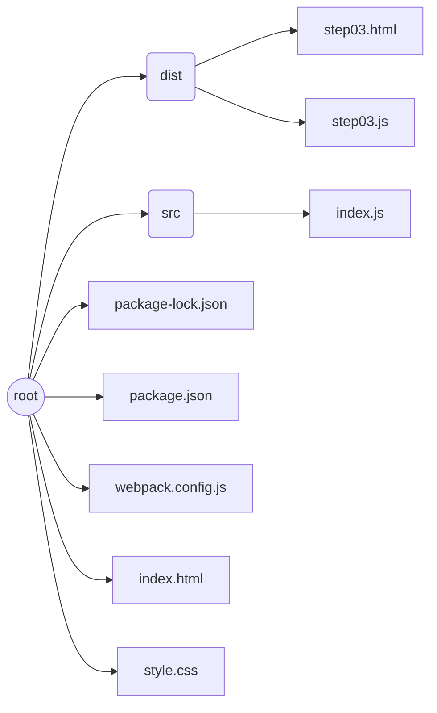
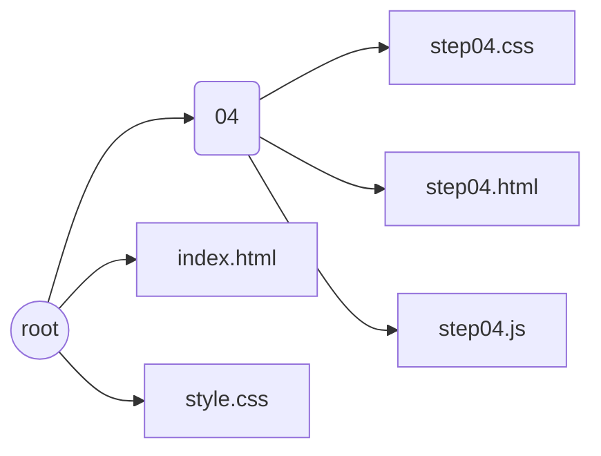

# Reading and manipulating css custom variables with JS

This is a practice project, The goal is:

> reading some custom `css-variable`s from a `*.css` file, adding it into a `.html` file , and make it interactively changeable

*<small>_for more information on `` read these two articles: [MDN](https://developer.mozilla.org/en-US/docs/Web/CSS/Using_CSS_custom_properties) | [CSS-Tricks](https://css-tricks.com/a-complete-guide-to-custom-properties/)</small>*

## File 01

Here I'm just working with `style.css` containing some `css-variables`. the result is produced in `step01.html` file.

- The `step01.js` doesn't do anything but logging a description about what's going on.
- The `index.html` provided just for navigating between steps.

## File 02

Here I'm actually creating a `link` element in `step02.js` file, attaching the `style.css` to it and adding it into the `step02.html` file.

## File 03

With the help of webpack, I import the `style.css` in the `index.js` file and bundle it to the `dist/step03.html`.

## File 04
 

In this example, the `style.css` isn't use 'cause it's completely different markUp.

There're some `css-variable`s defined in `step04.css`. There's a `cssData` object  in `step04.js` which is an imaginary presentation of fetched `css-variable`s from `step04.css`.

Once a colored circle is clicked, the `cssData` is updated and the theme has changed

## File 05
 

The implementation of the former file was a little complicated. There's better solution for Implementing the `reColor()` function, which is using `setProperty` on the `root` element.